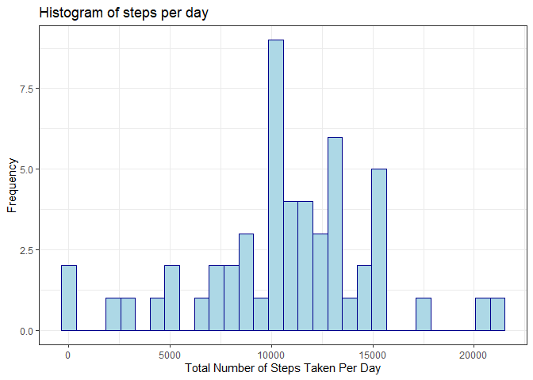
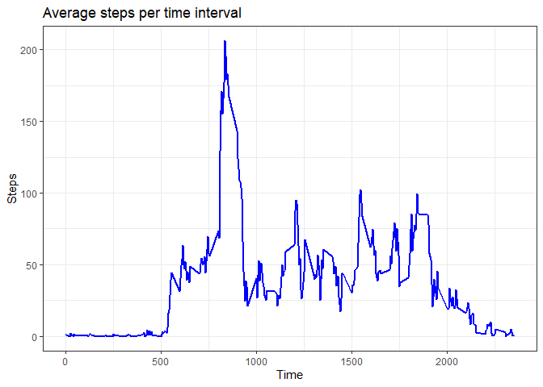
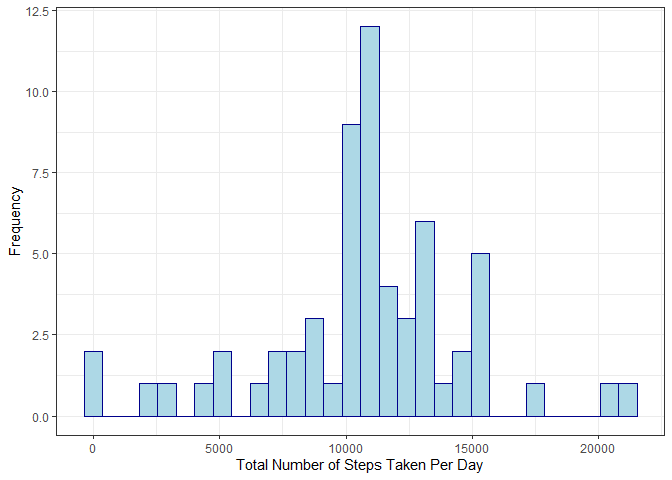

Reproducible Research Peer Grading Assignment.Rmd
================
Ceyda Çaylak
01-08-2021

Loading and preprocessing the data:

``` r
library(dplyr)
library(ggplot2)
library(skimr)
library(Hmisc)
library(lubridate)

Sys.setlocale("LC_TIME", "English")
```

    ## [1] "English_United States.1252"

``` r
data <- read.csv("activity.csv", header = TRUE, na.strings=c("",".","NA"))
head(data)
```

    ##   steps       date interval
    ## 1    NA 2012-10-01        0
    ## 2    NA 2012-10-01        5
    ## 3    NA 2012-10-01       10
    ## 4    NA 2012-10-01       15
    ## 5    NA 2012-10-01       20
    ## 6    NA 2012-10-01       25

``` r
str(data)
```

    ## 'data.frame':    17568 obs. of  3 variables:
    ##  $ steps   : int  NA NA NA NA NA NA NA NA NA NA ...
    ##  $ date    : chr  "2012-10-01" "2012-10-01" "2012-10-01" "2012-10-01" ...
    ##  $ interval: int  0 5 10 15 20 25 30 35 40 45 ...

## What is mean total number of steps taken per day?

``` r
total_steps <- data %>% 
    group_by(date) %>% 
    summarise(daily_steps = sum(steps))

head(total_steps)
```

    ## # A tibble: 6 x 2
    ##   date       daily_steps
    ##   <chr>            <int>
    ## 1 2012-10-01          NA
    ## 2 2012-10-02         126
    ## 3 2012-10-03       11352
    ## 4 2012-10-04       12116
    ## 5 2012-10-05       13294
    ## 6 2012-10-06       15420

Histogram of total number of steps taken per day:

``` r
ggplot(data = total_steps, aes(daily_steps)) +
    geom_histogram(col="darkblue", fill="lightblue") +
    ggtitle("Histogram of steps per day") +
    xlab("Total Number of Steps Taken Per Day") +
    ylab("Frequency") +
    theme_bw()
```

<!-- -->

## Mean and median number of steps taken each day:

``` r
mean(total_steps$daily_steps, na.rm = TRUE)
```

    ## [1] 10766.19

``` r
median(total_steps$daily_steps, na.rm = TRUE)
```

    ## [1] 10765

## The 5-minute interval that, on average, contains the maximum number of steps

``` r
average_interval_steps <- data %>% 
    group_by(interval) %>% 
    summarise(average_steps = mean(steps, na.rm = TRUE))
```

``` r
ggplot(data = average_interval_steps, aes(x = interval, y = average_steps)) +
    geom_line(color = "blue", size = 1) +
    ggtitle("Average steps per time interval") +
    xlab("Time") +
    ylab("Steps") +
    theme_bw()
```

<!-- -->

## 5-minute interval that contains the maximum number of steps is the 835th interval.

``` r
average_interval_steps[which.max(average_interval_steps$average_steps),]$interval
```

    ## [1] 835

## Code to describe and show a strategy for imputing missing data:

``` r
str(data)
```

    ## 'data.frame':    17568 obs. of  3 variables:
    ##  $ steps   : int  NA NA NA NA NA NA NA NA NA NA ...
    ##  $ date    : chr  "2012-10-01" "2012-10-01" "2012-10-01" "2012-10-01" ...
    ##  $ interval: int  0 5 10 15 20 25 30 35 40 45 ...

``` r
skim_without_charts(data)
```

|                                                  |       |
|:-------------------------------------------------|:------|
| Name                                             | data  |
| Number of rows                                   | 17568 |
| Number of columns                                | 3     |
| \_\_\_\_\_\_\_\_\_\_\_\_\_\_\_\_\_\_\_\_\_\_\_   |       |
| Column type frequency:                           |       |
| character                                        | 1     |
| numeric                                          | 2     |
| \_\_\_\_\_\_\_\_\_\_\_\_\_\_\_\_\_\_\_\_\_\_\_\_ |       |
| Group variables                                  | None  |

Data summary

**Variable type: character**

| skim\_variable | n\_missing | complete\_rate | min | max | empty | n\_unique | whitespace |
|:---------------|-----------:|---------------:|----:|----:|------:|----------:|-----------:|
| date           |          0 |              1 |  10 |  10 |     0 |        61 |          0 |

**Variable type: numeric**

| skim\_variable | n\_missing | complete\_rate |    mean |     sd |  p0 |    p25 |    p50 |     p75 | p100 |
|:---------------|-----------:|---------------:|--------:|-------:|----:|-------:|-------:|--------:|-----:|
| steps          |       2304 |           0.87 |   37.38 | 112.00 |   0 |   0.00 |    0.0 |   12.00 |  806 |
| interval       |          0 |           1.00 | 1177.50 | 692.45 |   0 | 588.75 | 1177.5 | 1766.25 | 2355 |

“Steps” variable has 2304 missing values

I will replace the missing values in “steps” variable with the average
values of it. First I created a new variable “activity” that is the same
as the original data, then filled the missing values with the average
values in “steps” variable, which is 37.3826

``` r
activity <- data 

activity$steps <- impute(data$steps, fun = mean)
```

## Histogram of the total number of steps taken each day after missing values are imputed:

``` r
imputed_total_steps <- activity %>% 
    group_by(date) %>% 
    summarise(imputed_total_steps = sum(steps))
```

``` r
ggplot(data = imputed_total_steps , aes(imputed_total_steps)) +
    geom_histogram(col="darkblue", fill="lightblue") +
    xlab("Total Number of Steps Taken Per Day") +
    ylab("Frequency") +
    theme_bw()
```

<!-- -->

``` r
mean(imputed_total_steps$imputed_total_steps, na.rm = TRUE)
```

    ## [1] 10766.19

``` r
median(imputed_total_steps$imputed_total_steps, na.rm = TRUE)
```

    ## [1] 10766.19

After filling the missing values, unsurprisingly, the mean value of
steps didn’t change because I filled the missing values with the average
value. But the median value changed from 10765 to 10766.19.

## Panel plot comparing the average number of steps taken per 5-minute interval across weekdays and weekends:

``` r
day_of_week <- activity %>%
    mutate(
        date = ymd(date),
        weekday_or_weekend = case_when(wday(date) %in% 2:6 ~ "Weekday",
                                       wday(date) %in% c(1,7) ~ "Weekend")
    ) %>%
    group_by(interval, weekday_or_weekend) %>%
    summarise(
        steps = mean(steps)
    )
```

``` r
head(day_of_week)
```

    ## # A tibble: 6 x 3
    ## # Groups:   interval [3]
    ##   interval weekday_or_weekend steps
    ##      <int> <chr>              <dbl>
    ## 1        0 Weekday             7.01
    ## 2        0 Weekend             4.67
    ## 3        5 Weekday             5.38
    ## 4        5 Weekend             4.67
    ## 5       10 Weekday             5.14
    ## 6       10 Weekend             4.67

``` r
ggplot(day_of_week, aes(interval, steps)) + 
    geom_line(color = "blue", size = 1) + 
    facet_wrap(~weekday_or_weekend, nrow = 2, ncol = 1) +
    xlab("5-Minute intervals") + 
    ylab("Average number of steps") +
    theme_bw()
```

<!-- -->

## Are there differences in activity patterns between weekdays and weekends?

On weekdays, most of the steps are done between 500-1000th intervals. On
weekends, most of the steps are done between 1000-1750th intervals.
